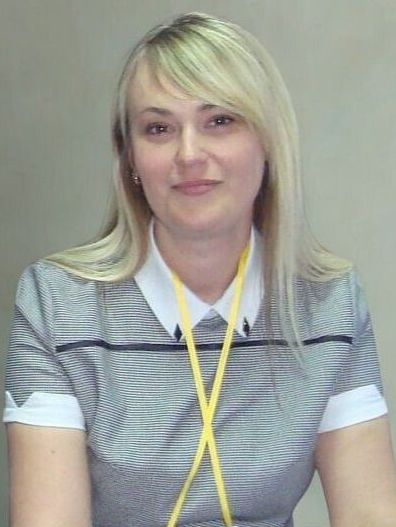

# Portfolio_Андрєєва
<!DOCTYPE html>
<html lang="uk">
<head>
    <meta charset="UTF-8">
    <meta name="viewport" content="width=device-width, initial-scale=1.0">
    <title>Портфоліо вчителя математики - Андрєєва Світлана Володимирівна</title>
    
</head>
<body>
    

        

        

        

    

    

        

            

            

                

                    

                        

                        
                        <!-- ВАРІАНТ 1: Якщо ваше фото називається photo.jpg -->
                        
                        
                        <!-- ВАРІАНТ 2: Якщо фото називається інакше, змініть назву нижче -->
                        <!--  -->
                        
                        <!-- ВАРІАНТ 3: Використайте повний шлях до фото -->
                        <!--  -->
                    

                

                

                    <h1>Андрєєва Світлана Володимирівна</h1>
                    
🎓 Вчитель математики та інформатики

                    

                        <a href="mailto:svetlanaburkatfndreeva@gmail.com" class="contact-btn">
                            📧 svetlanaburkatfndreeva@gmail.com
                        </a>
                    

                    

                        📍 КЗО "Інгулецький ліцей "ДОР", м. Кривий Ріг
                    

                    

                        <a href="https://svetlanaburkatfndreeva.blogspot.com/" target="_blank" class="contact-btn">
                            📝 Блог вчителя
                        </a>
                        <a href="https://andreeva2024.blogspot.com/" target="_blank" class="contact-btn">
                            📐 Кабінет математики
                        </a>
                        <a href="https://in4ma6ka.blogspot.com/" target="_blank" class="contact-btn">
                            💻 Кабінет інформатики
                        </a>
                    

                    

                        

                            23+
                            років досвіду
                        

                        

                            I
                            категорія
                        

                        

                            45+
                            курсів ПК
                        

                        

                            608+
                            годин навчання
                        

                    

                

            

        

        

            

                <button class="nav-tab active" onclick="showTab('about')">
                    👤 Про мене
                </button>
                <button class="nav-tab" onclick="showTab('achievements')">
                    🏆 Досягнення
                </button>
                <button class="nav-tab" onclick="showTab('professional')">
                    💼 Діяльність
                </button>
                <button class="nav-tab" onclick="showTab('courses')">
                    🎓 Курси ПК
                </button>
                <button class="nav-tab" onclick="showTab('philosophy')">
                    💡 Філософія
                </button>
            

        

        

            

                

                    <h2 class="section-title">🎓 Освіта та досвід</h2>
                    

                        

                            
🎓

                            <h3>Освіта</h3>
                            
<strong>Криворізький державний педагогічний університет</strong>

                            
Факультет математики та інформатики

                            
2004 рік

                        

                        

                            
🏅

                            <h3>Кваліфікація</h3>
                            
<strong>Перша кваліфікаційна категорія</strong>

                            
Вчитель математики та інформатики вищої категорії

                        

                    

                

                

                    <h2 class="section-title">💼 Досвід роботи</h2>
                    

                        

                            <h3>КЗО "Інгулецький ліцей "ДОР"</h3>
                            
2022 - теперішній час

                            
<strong>Вчитель математики та інформатики</strong>

                            
Підготовка учнів до олімпіад, проведення консультацій, експертна діяльність, ведення освітніх блогів

                        

                        

                            <h3>ЗОШ І-ІІІ ступенів № 59 м. Кривого Рогу</h3>
                            
2002 - 2022

                            
<strong>Вчитель математики</strong>

                            
20 років успішної педагогічної практики, підготовка призерів олімпіад

                        

                    

                

                

                    <h2 class="section-title">🌐 Онлайн-ресурси та блоги</h2>
                    

                        

                            
📝

                            <h3>Блог вчителя математики</h3>
                            
Особистий блог з методичними матеріалами, досвідом роботи, розробками уроків та цікавими знахідками для вчителів математики.

                            <a href="https://svetlanaburkatfndreeva.blogspot.com/" target="_blank" style="display: inline-block; margin-top: 15px; padding: 10px 20px; background: linear-gradient(135deg, #667eea 0%, #764ba2 100%); color: white; text-decoration: none; border-radius: 10px; font-weight: 600;">
                                Відвідати блог →
                            </a>
                        

                        

                            
📐

                            <h3>Кабінет математики</h3>
                            
Віртуальний кабінет математики з навчальними матеріалами, завданнями для учнів, презентаціями та корисними посиланнями.

                            <a href="https://andreeva2024.blogspot.com/" target="_blank" style="display: inline-block; margin-top: 15px; padding: 10px 20px; background: linear-gradient(135deg, #667eea 0%, #764ba2 100%); color: white; text-decoration: none; border-radius: 10px; font-weight: 600;">
                                Відвідати кабінет →
                            </a>
                        

                        

                            
💻

                            <h3>Кабінет інформатики</h3>
                            
Віртуальний кабінет інформатики з матеріалами для уроків, проектами учнів, посиланнями на корисні сервіси та ресурси.

                            <a href="https://in4ma6ka.blogspot.com/" target="_blank" style="display: inline-block; margin-top: 15px; padding: 10px 20px; background: linear-gradient(135deg, #667eea 0%, #764ba2 100%); color: white; text-decoration: none; border-radius: 10px; font-weight: 600;">
                                Відвідати кабінет →
                            </a>
                        

                    

                

                

                    <h2 class="section-title">🎯 Ключові компетенції</h2>
                    

                        

                            
📊

                            
Підготовка до олімпіад

                        

                        

                            
💻

                            
Цифрові технології

                        

                        

                            
🎓

                            
Методична робота

                        

                        

                            
👥

                            
Робота з обдарованими

                        

                    

                

            

            

                

                    <h2 class="section-title">🏆 Олімпіадні досягнення учнів</h2>
                    
                    

                        <h4>🌟 Студникова Агнія</h4>
                        
202320242025

                        
<strong>Призер районних, міських та обласних турів Всеукраїнської олімпіади з математики</strong>

                        <ul class="list-modern">
                            <li>Стабільні результати протягом 3 років</li>
                            <li>Обласний рівень змагань</li>
                            <li>Систематична підготовка та високі досягнення</li>
                        </ul>
                    

                    

                        <h4>⭐ Ткаченко Олеся</h4>
                        
2024

                        
<strong>Призер районного та міського турів Всеукраїнської олімпіади з математики</strong>

                        <ul class="list-modern">
                            <li>Успішний дебют на олімпіадах</li>
                            <li>Високий рівень підготовки</li>
                        </ul>
                    

                

                

                    <h2 class="section-title">🌐 Інтернет-олімпіади та конкурси</h2>
                    

                        <h3>💻 Постійна участь учнів у онлайн-змаганнях</h3>
                        <ul class="list-modern">
                            <li>Всеукраїнська інтернет-олімпіада «На Урок»</li>
                            <li>Олімпіада від Всеосвіти</li>
                            <li>Всеукраїнські шкільні олімпіади від JustClass</li>
                            <li>Математичні конкурси на платформі МійКлас</li>
                        </ul>
                    

                

            

            

                

                    <h2 class="section-title">🎖️ Професійні досягнення</h2>
                    

                        

                            <h3>🏅 Нагороди та відзнаки</h3>
                            
Численні грамоти та подяки районного та міського рівнів за:

                            <ul class="list-modern">
                                <li>Якісну підготовку учнів</li>
                                <li>Внесок у розвиток математичної освіти</li>
                                <li>Професійну майстерність</li>
                            </ul>
                        

                        

                            <h3>👨‍⚖️ Експертна діяльність</h3>
                            
<strong>Член журі олімпіад:</strong>

                            <ul class="list-modern">
                                <li>Районний етап Всеукраїнської олімпіади</li>
                                <li>Міський етап Всеукраїнської олімпіади</li>
                                <li>Конкурс "Студія математичних ідей"</li>
                            </ul>
                        

                    

                

                

                    <h2 class="section-title">📚 Методична та освітня робота</h2>
                    
                    

                        <h4>💻 Цифрова діяльність</h4>
                        <ul class="list-modern">
                            <li>Розміщення тестів та публікацій на сайті "Всеосвіта"</li>
                            <li>Ведення трьох тематичних блогів (математика, інформатика)</li>
                            <li>Активна участь у професійних онлайн-спільнотах</li>
                        </ul>
                    

                    

                        <h4>🎓 Консультаційна діяльність</h4>
                        <ul class="list-modern">
                            <li>Проведення консультацій з математики для учнів 7 класів на міському освітньому порталі</li>
                            <li>Консультації для учнів з предметів базового компоненту освітньої програми</li>
                            <li>Індивідуальна підтримка обдарованих учнів</li>
                            <li>Підготовка до олімпіад та конкурсів</li>
                        </ul>
                    

                    

                        <h4>✍️ Методичні розробки</h4>
                        <ul class="list-modern">
                            <li>Розробка дидактичних матеріалів</li>
                            <li>Впровадження інноваційних підходів до викладання</li>
                            <li>Підготовка учнів до олімпіад та конкурсів</li>
                        </ul>
                    

                

            

            

                

                    <h2 class="section-title">🎓 Підвищення кваліфікації</h2>
                    
                    

                        

                            
45+

                            
Курсів 2021-2025

                        

                        

                            
608+

                            
Годин навчання

                        

                        

                            
100%

                            
Сертифіковано

                        

                    

                    

                        <button class="filter-btn active" onclick="filterCourses('all')">Всі курси</button>
                        <button class="filter-btn" onclick="filterCourses('2025')">2025 рік</button>
                        <button class="filter-btn" onclick="filterCourses('2024')">2024 рік</button>
                        <button class="filter-btn" onclick="filterCourses('2023')">2023 рік</button>
                    

                    

                        

                            
2025

                        

                        

                            
Організація освітнього процесу з математики та інформатики у НУШ

                            

                                📅 13-24.10.2025
                                ⏱️ 60 годин
                            

                            
<strong>Організатор:</strong> Дніпровська академія неперервної освіти

                            Свідоцтво СПК
                        

                        

                            
Оновлення методичного інструментарію учителів інформатики

                            

                                📅 22-26.09.2025
                                ⏱️ 30 годин
                            

                            
<strong>Організатор:</strong> Дніпровська академія неперервної освіти

                            Свідоцтво СПК
                        

                        

                            
2024

                        

                        

                            
Організація освітнього процесу з математики у 7-9 класах

                            

                                📅 01.11.2024
                                ⏱️ 30 годин
                            

                            
<strong>Організатор:</strong> Дніпровська академія неперервної освіти

                            Свідоцтво СПК
                        

                        

                            
2023

                        

                        

                            
Наздоженемо: практичні аспекти подолання освітніх втрат з математики

                            

                                📅 27.12.2023
                                ⏱️ 15 годин
                            

                            
<strong>Організатор:</strong> ГС «Освіторія»

                            Сертифікат
                        

                        

                            <h3>📊 Детальна статистика</h3>
                            
<strong style="color: #667eea;">2025:</strong> 11 курсів (253+ годин)

                            
<strong style="color: #667eea;">2024:</strong> 10 курсів (131.5 годин)

                            
<strong style="color: #667eea;">2023:</strong> 10 курсів (95 годин)

                            
<strong style="color: #667eea;">2022:</strong> 5 курсів (27+ годин)

                            
<strong style="color: #667eea;">2021:</strong> 7 курсів (102+ годин)

                            
Загалом: 608+ годин професійного розвитку

                        

                    

                

            

            

                

                    <h2 class="section-title">💡 Педагогічна філософія</h2>
                    

                        Математика — це не лише формули та теореми, це спосіб мислення та інструмент для розуміння світу. Моє завдання — не просто навчити рахувати, а розвинути у дітей логічне мислення, аналітичні здібності та впевненість у своїх силах. Кожен учень здатен досягти успіху, якщо знайти правильний підхід та надати необхідну підтримку.
                    

                

                

                    <h2 class="section-title">🎯 Педагогічні принципи</h2>
                    

                        

                            <h3>🌱 Індивідуальний підхід</h3>
                            
Кожна дитина унікальна. Прагну знайти особливий ключик до кожного учня, враховуючи його темп навчання, інтереси та здібності.

                        

                        

                            <h3>💪 Розвиток потенціалу</h3>
                            
Віра у можливості кожного учня. Створення умов для розкриття талантів та подолання труднощів у навчанні.

                        

                        

                            <h3>🔍 Критичне мислення</h3>
                            
Формування навичок аналізу, логічного мислення та вміння вирішувати нестандартні задачі.

                        

                        

                            <h3>🌟 Любов до предмета</h3>
                            
Прагну показати красу математики, її практичне застосування та важливість у повсякденному житті.

                        

                    

                

            

        

    

    <button class="scroll-top" id="scrollTop" onclick="scrollToTop()">
        ↑
    </button>

    
</body>
</html>
